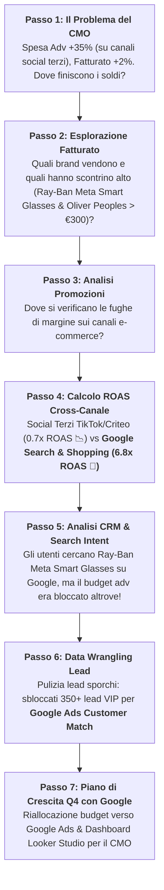

# 📖 Luxottica Data Narrative Script: Step-by-Step Investigation (Google Ecosystem Edition)
## "Unlocking High-ROAS Google Ads Growth & Capturing Ray-Ban Meta Search Demand"

This document outlines the step-by-step analytical narrative for trainers and participants during the 3-hour Luxottica BigQuery workshop.

---



---

## 🎬 Step-by-Step Analytical Script

### 🚨 PASSO 1: Il Problema di Business (15:30)
- **Contesto:** Il CMO di Luxottica affronta una sfida prima del Q4: il budget pubblicitario è aumentato del **+35%** (a causa di pesanti investimenti su reti social terze e display frammentate), ma il fatturato e-commerce è cresciuto solo del **+2%**.
- **La Domanda di Business:** *Quali canali stanno sprecando budget e dove dobbiamo riallocare le risorse per massimizzare il ritorno sulle vendite prima del Black Friday?*

---

### 🔎 PASSO 2: Esplorazione del Fatturato per Brand (16:15 - Challenge 1, Parte A)
- **Azione SQL:**
  ```sql
  SELECT brand, COUNT(order_id) AS total_orders, ROUND(SUM(revenue_eur), 2) AS total_revenue
  FROM `qwiklabs-gcp-04-9efaa47f1d21.luxottica_marketing_analytics.lux_online_orders`
  GROUP BY brand ORDER BY total_revenue DESC;
  ```
- **Cosa Dicono i Dati:**
  - *Ray-Ban* e *Oakley* guidano i volumi complessivi di vendita.
  - *Ray-Ban Meta Smart Glasses* e *Oliver Peoples* registrano lo scontrino medio (AOV) più alto della catena (> €300/ordine), rappresentando la massima opportunità di margine per Luxottica!

---

### 📉 PASSO 3: L'Analisi delle Promozioni per Canale (16:30 - Challenge 1, Parte C)
- **Azione SQL:**
  ```sql
  SELECT brand, channel, ROUND(AVG(discount_amount_eur), 2) AS avg_discount
  FROM `qwiklabs-gcp-04-9efaa47f1d21.luxottica_marketing_analytics.lux_online_orders`
  WHERE discount_amount_eur > 0
  GROUP BY brand, channel ORDER BY avg_discount DESC;
  ```
- **Cosa Dicono i Dati (Primo Indizio):**
  - I canali di affiliazione terzi stanno erodendo i margini con sconti continuativi non necessari su prodotti ad alto valore, mentre l'e-commerce diretto registra domanda organica elevata.

---

### 💰 PASSO 4: La Causa Radice: Calcolo del ROAS Cross-Canale (17:20 - Challenge 2, Parte B)
- **Azione SQL (Unione Adv Spend + Sales Revenue via CTE):**
  ```sql
  WITH spend_by_brand AS (
    SELECT brand, platform, SUM(spend_eur) AS total_spend
    FROM `qwiklabs-gcp-04-9efaa47f1d21.luxottica_marketing_analytics.lux_ad_spend`
    GROUP BY brand, platform
  ),
  revenue_by_brand AS (
    SELECT brand, SUM(revenue_eur) AS total_revenue
    FROM `qwiklabs-gcp-04-9efaa47f1d21.luxottica_marketing_analytics.lux_online_orders`
    GROUP BY brand
  )
  SELECT s.brand, s.platform, s.total_spend, r.total_revenue,
         ROUND(SAFE_DIVIDE(r.total_revenue, s.total_spend), 2) AS roas
  FROM spend_by_brand s
  JOIN revenue_by_brand r ON s.brand = r.brand
  ORDER BY roas DESC;
  ```
- **Cosa Dicono i Dati (La Rivelazione Ecosistema Google!):**
  - **Google Search, Google Shopping & Performance Max:** Generano un **ROAS strabiliante di 6.8x - 8.2x**! Catturano l'intenzione d'acquisto ad alto valore per *Oliver Peoples*, *Persol* e *Ray-Ban Meta Smart Glasses*, ma soffrono di budget limitati!
  - **Social Terzi e Display Frammentati (TikTok / Criteo):** Hanno assorbito il 40% del nuovo budget adv, generando un **ROAS fallimentare di 0.7x** (perdita netta per Luxottica!).

---

### 👥 PASSO 5: L'Opportunità Google Search Intent & CRM (17:35 - Challenge 2, Parte D)
- **Azione SQL:** Incrocio `lux_crm_customers` con gli ordini e la ricerca Google.
- **Cosa Dicono i Dati:**
  - Esiste una domanda di ricerca altissima su **Google Search** per *Ray-Ban Meta Smart Glasses*, ma Luxottica stava esaurendo il budget giornaliero di Google Ads a metà giornata a causa dei fondi bloccati su piattaforme social terze inefficienti.

---

### 🧹 PASSO 6: Sblocco Lead per Google Ads Customer Match (17:55 - Challenge 3)
- **Azione SQL / Visual Data Prep:** Pulizia e deduplicazione della tabella `lux_raw_marketing_leads_dirty`.
- **Cosa Dicono i Dati:**
  - La pulizia automatizzata sblocca **350+ lead VIP** pronti per essere caricati su **Google Ads Customer Match**, consentendo di attivare campagne di re-engagement ad altissima conversione su **YouTube Ads** e **Google Search**!

---

### 📊 PASSO 7: Il Piano di Crescita Q4 con Google per il CMO (18:15)
1. **Spostare il 60% del budget dalle reti terze inefficienti verso Google Ads (Google Search, Google Shopping, YouTube Ads e Performance Max)**.
2. **Aumentare la copertura di ricerca su Google Ads** per i prodotti ad alto margine (*Ray-Ban Meta Smart Glasses* e *Oliver Peoples*) garantendo il 100% della quota d'impressione.
3. **Attivare i 350 lead VIP recuperati** tramite Google Ads Customer Match.
4. **Pubblicare il Dashboard di Crescita in Looker Studio** collegato direttamente a BigQuery!
