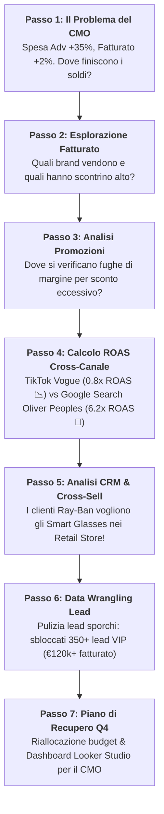

# 📖 Luxottica Data Narrative Script: Step-by-Step Investigation
## "The Mystery of the Leaky Ad Budget & The Smart Glasses Breakthrough"

This document outlines the step-by-step analytical narrative for trainers and participants during the 3-hour Luxottica BigQuery workshop.

---



---

## 🎬 Step-by-Step Analytical Script

### 🚨 PASSO 1: Il Problema di Business (15:30)
- **Contesto:** Il CMO di Luxottica affronta una crisi prima del Q4: il budget pubblicitario sui canali digitali è aumentato del **+35%**, ma il fatturato online è cresciuto solo del **+2%**.
- **La Domanda di Business:** *Perché l'aumento dell'investimento adv non sta generando fatturato proporzionale? Quali canali o campagne stanno sprecando budget?*

---

### 🔎 PASSO 2: Esplorazione del Fatturato per Brand (16:15 - Challenge 1, Parte A)
- **Azione SQL:**
  ```sql
  SELECT brand, COUNT(order_id) AS total_orders, ROUND(SUM(revenue_eur), 2) AS total_revenue
  FROM `qwiklabs-gcp-04-9efaa47f1d21.luxottica_marketing_analytics.lux_online_orders`
  GROUP BY brand ORDER BY total_revenue DESC;
  ```
- **Cosa Dicono i Dati:**
  - *Ray-Ban* e *Oakley* guidano i volumi complessivi di vendita.
  - *Ray-Ban Meta Smart Glasses* e *Oliver Peoples* registrano lo scontrino medio (AOV) più alto della catena (> €300/ordine), ma i volumi di transazione sono ancora bassi.

---

### 📉 PASSO 3: L'Analisi della Fuga di Margine (16:30 - Challenge 1, Parte C)
- **Azione SQL:**
  ```sql
  SELECT brand, channel, ROUND(AVG(discount_amount_eur), 2) AS avg_discount
  FROM `qwiklabs-gcp-04-9efaa47f1d21.luxottica_marketing_analytics.lux_online_orders`
  WHERE discount_amount_eur > 0
  GROUP BY brand, channel ORDER BY avg_discount DESC;
  ```
- **Cosa Dicono i Dati (Primo Indizio):**
  - Sul canale *E-Commerce Direct*, il brand *Vogue Eyewear* registra sconti continuativi del **25-35%**, erosivi del margine netto. Stiamo scontando prodotti ad acquisto d'impulso senza generare fedeltà.

---

### 💰 PASSO 4: La Causa Radice: Calcolo del ROAS Cross-Canale (17:20 - Challenge 2, Parte B)
- **Azione SQL (Unione Adv Spend + Sales Revenue via CTE):**
  ```sql
  WITH spend_by_brand AS (
    SELECT brand, platform, SUM(spend_eur) AS total_spend
    FROM `qwiklabs-gcp-04-9efaa47f1d21.luxottica_marketing_analytics.lux_ad_spend`
    GROUP BY brand, platform
  ),
  revenue_by_brand AS (
    SELECT brand, SUM(revenue_eur) AS total_revenue
    FROM `qwiklabs-gcp-04-9efaa47f1d21.luxottica_marketing_analytics.lux_online_orders`
    GROUP BY brand
  )
  SELECT s.brand, s.platform, s.total_spend, r.total_revenue,
         ROUND(SAFE_DIVIDE(r.total_revenue, s.total_spend), 2) AS roas
  FROM spend_by_brand s
  JOIN revenue_by_brand r ON s.brand = r.brand
  ORDER BY roas ASC;
  ```
- **Cosa Dicono i Dati (La Causa Radice Identificata!):**
  - **TikTok su Vogue Eyewear:** Assorbe il 40% dell'aumento di budget adv, generando un **ROAS di 0.8x** (perdita netta!).
  - **Google Search su Oliver Peoples & Persol:** Ha un budget ridotto, ma genera un **ROAS di 6.2x**!

---

### 👥 PASSO 5: L'Opportunità di Cross-Sell nel CRM (17:35 - Challenge 2, Parte D)
- **Azione SQL:** Incrocio `lux_crm_customers` con gli ordini nei *Retail Store*.
- **Cosa Dicono i Dati:**
  - I clienti con preferenza *Ray-Ban* acquistano frequentemente gli *Smart Glasses Ray-Ban Meta* nei negozi fisici, ma non ricevono campagne adv digitali mirate su questo prodotto.

---

### 🧹 PASSO 6: Sblocco del Valore dai Lead Sporchi (17:55 - Challenge 3)
- **Azione SQL / Visual Data Prep:** Pulizia e deduplicazione della tabella `lux_raw_marketing_leads_dirty`.
- **Cosa Dicono i Dati:**
  - La pulizia automatizzata sblocca **350+ lead VIP** abbandonati, per un valore potenziale di **€120.000+** in vista del Q4.

---

### 📊 PASSO 7: Il Piano di Recupero Q4 per il CMO (18:15)
1. **Taglio del 50% del budget TikTok su Vogue Eyewear** (eliminazione della dispersione).
2. **Riallocazione del budget su Google Search per Oliver Peoples, Persol e Ray-Ban Meta Smart Glasses** (massimizzazione del ROAS).
3. **Attivazione dei 350 lead VIP recuperati**.
4. **Pubblicazione del Dashboard interattivo in Looker Studio**!
