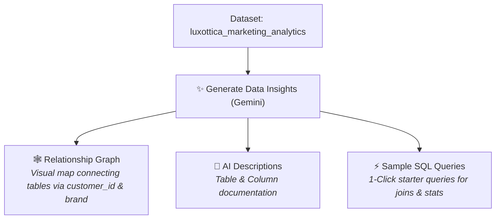
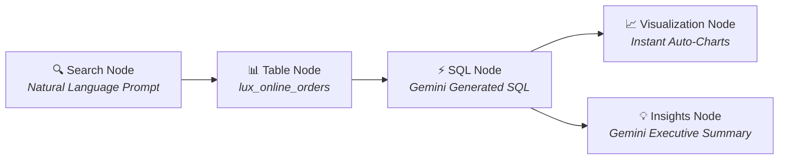

# Module 01 & 02: BigQuery Fundamentals, Data Canvas & BigQuery Data Insights
**Luxottica Marketing Data Training**  
**GCP Project ID:** `qwiklabs-gcp-04-9efaa47f1d21` (`bigquery-luxottica`)  
**Target Dataset:** `qwiklabs-gcp-04-9efaa47f1d21.luxottica_marketing_analytics`  
**Date:** Oct 12th, 2026 | **Time:** 15:30 - 16:45

---

## 1. Enterprise Data Warehouse vs. Spreadsheets

| Dimension | Spreadsheets (Excel / Google Sheets) | Enterprise Data Warehouse (Google BigQuery) |
| :--- | :--- | :--- |
| **Data Volume Limit** | ~1 Million rows per tab | Billions / Petabytes of rows |
| **Processing Speed** | Slows down / freezes with >100k rows | Sub-second response on millions of rows |
| **Data Integrity** | Prone to manual overwrites & broken formulas | Immutable raw storage, strict schemas, audit logs |
| **Concurrency** | File locking, version conflicts | Thousands of concurrent analytical queries |
| **Cost Model** | Software licensing | Serverless, pay-per-query / slot reservation |

---

## 2. Navigating BigQuery Studio: BigQuery Data Insights & Data Canvas

Google Cloud provides AI-powered discovery and analysis tools in BigQuery Studio powered by **Gemini in BigQuery**:

### 2.1 BigQuery Data Insights (`docs.cloud.google.com/bigquery/docs/data-insights`)
When encountering a new, unfamiliar marketing dataset, analysts face the "cold start problem": *What is in this dataset, and how do the tables connect?*

**BigQuery Data Insights** (integrated with Knowledge Catalog) automatically generates:

1. **Interactive Relationship Graphs:** A visual map showing connections, dependencies, and join keys (schema-defined or Gemini LLM-inferred) across `lux_crm_customers`, `lux_online_orders`, and `lux_ad_spend`.
2. **AI-Generated Table & Column Descriptions:** Automated plain-language documentation explaining what each column represents (e.g. `revenue_eur`, `loyalty_tier`, `spend_eur`). Analysts can review, edit, and publish these descriptions directly to Knowledge Catalog.
3. **Sample SQL Queries:** Automatically generated, context-aware SQL queries (with natural language prompts) that jump-start statistical analysis and multi-table joins with 1 click!



---

### 2.2 BigQuery Data Canvas (AI-Powered Visual Node Workspace)
**BigQuery Data Canvas** is an interactive, visual, node-based workspace. Instead of writing raw code from scratch, you can explore data visually using connected **Nodes**:



#### Core Data Canvas Nodes:
- **Search Node:** Find datasets across Luxottica using natural language prompts (e.g., *"Find Ray-Ban sales in Q3 2026"*).
- **Table Node:** Schema previews and data profiling histograms.
- **SQL Node:** Houses SQL queries generated automatically by Gemini or edited manually.
- **Visualization Node:** Automatically builds bar charts, line graphs, and pie charts directly from query outputs.
- **Insights Node:** Generates executive natural-language summaries, statistical trends, anomaly flags, and correlations.

---

## 3. SQL Query Fundamentals (Module 02)

### 3.1 Basic Syntax Structure
```sql
SELECT
    column_1,
    column_2,
    AGGREGATE_FUNCTION(column_3) AS metric_alias
FROM
    `qwiklabs-gcp-04-9efaa47f1d21.luxottica_marketing_analytics.table_name`
WHERE
    filter_condition
GROUP BY
    column_1,
    column_2
HAVING
    aggregate_condition
ORDER BY
    metric_alias DESC
LIMIT 100;
```

### 3.2 Core Analytical Queries for Luxottica

#### Query 1: Exploring Brand Revenue & Order Volume
```sql
SELECT
  brand,
  COUNT(order_id) AS total_orders,
  SUM(units_sold) AS total_units,
  ROUND(SUM(revenue_eur), 2) AS total_revenue_eur,
  ROUND(AVG(revenue_eur), 2) AS avg_order_value_eur
FROM
  `qwiklabs-gcp-04-9efaa47f1d21.luxottica_marketing_analytics.lux_online_orders`
GROUP BY
  brand
ORDER BY
  total_revenue_eur DESC;
```

#### Query 2: Filtering Top Performing Sales Channels
```sql
SELECT
  channel,
  product_category,
  COUNT(order_id) AS total_orders,
  SUM(revenue_eur) AS total_revenue
FROM
  `qwiklabs-gcp-04-9efaa47f1d21.luxottica_marketing_analytics.lux_online_orders`
WHERE
  revenue_eur >= 150.00
GROUP BY
  channel,
  product_category
ORDER BY
  total_revenue DESC;
```
