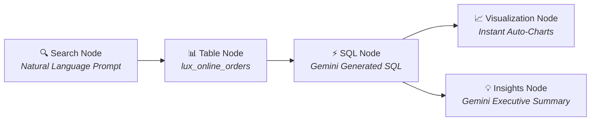

# Module 01 & 02: BigQuery Fundamentals, Data Canvas & AI Insights
**Luxottica Marketing Data Training**  
**GCP Project ID:** `qwiklabs-gcp-04-9efaa47f1d21` (`bigquery-luxottica`)  
**Target Dataset:** `qwiklabs-gcp-04-9efaa47f1d21.luxottica_marketing_analytics`  
**Date:** Oct 12th, 2026 | **Time:** 15:30 - 16:45

---

## 1. Enterprise Data Warehouse vs. Spreadsheets

| Dimension | Spreadsheets (Excel / Google Sheets) | Enterprise Data Warehouse (Google BigQuery) |
| :--- | :--- | :--- |
| **Data Volume Limit** | ~1 Million rows per tab | Billions / Petabytes of rows |
| **Processing Speed** | Slows down / freezes with >100k rows | Sub-second response on millions of rows |
| **Data Integrity** | Prone to manual overwrites & broken formulas | Immutable raw storage, strict schemas, audit logs |
| **Concurrency** | File locking, version conflicts | Thousands of concurrent analytical queries |
| **Cost Model** | Software licensing | Serverless, pay-per-query / slot reservation |

---

## 2. Navigating BigQuery Studio: Data Canvas & Gemini Insights

Google Cloud provides two ways to interact with marketing data in BigQuery Studio:

### 2.1 The Standard SQL Editor
- **URL:** `https://console.cloud.google.com/bigquery?project=qwiklabs-gcp-04-9efaa47f1d21`
- Best for writing direct GoogleSQL scripts, creating tables, and building structured Views.

### 2.2 BigQuery Data Canvas & AI Insights (Node-Based Workspace)
**BigQuery Data Canvas** is an interactive, visual, node-based workspace powered by **Gemini in BigQuery**. Instead of writing raw code from scratch, you can explore data visually using connected **Nodes**:



#### Core Data Canvas Nodes for Marketing Analysts:
1. **Search Node:** Find datasets across Luxottica using natural language prompts (e.g., *"Find Ray-Ban sales in Q3 2026"*).
2. **Table Node:** Represents selected tables or views with schema previews and data profiling histograms.
3. **SQL Node:** Houses SQL queries generated automatically by Gemini or edited manually.
4. **Visualization Node:** Automatically builds bar charts, line graphs, and pie charts directly from query outputs.
5. **💡 Insights Node (NEW):** Automatically generates executive natural-language summaries, statistical trends, pattern detection, anomaly flags (e.g. ad spend spikes), and variable correlations out of raw query results!

---

## 3. SQL Query Fundamentals (Module 02)

### 3.1 Basic Syntax Structure
```sql
SELECT
    column_1,
    column_2,
    AGGREGATE_FUNCTION(column_3) AS metric_alias
FROM
    `qwiklabs-gcp-04-9efaa47f1d21.luxottica_marketing_analytics.table_name`
WHERE
    filter_condition
GROUP BY
    column_1,
    column_2
HAVING
    aggregate_condition
ORDER BY
    metric_alias DESC
LIMIT 100;
```

### 3.2 Core Analytical Queries for Luxottica

#### Query 1: Exploring Brand Revenue & Order Volume
```sql
SELECT
  brand,
  COUNT(order_id) AS total_orders,
  SUM(units_sold) AS total_units,
  ROUND(SUM(revenue_eur), 2) AS total_revenue_eur,
  ROUND(AVG(revenue_eur), 2) AS avg_order_value_eur
FROM
  `qwiklabs-gcp-04-9efaa47f1d21.luxottica_marketing_analytics.lux_online_orders`
GROUP BY
  brand
ORDER BY
  total_revenue_eur DESC;
```

#### Query 2: Filtering Top Performing Sales Channels
```sql
SELECT
  channel,
  product_category,
  COUNT(order_id) AS total_orders,
  SUM(revenue_eur) AS total_revenue
FROM
  `qwiklabs-gcp-04-9efaa47f1d21.luxottica_marketing_analytics.lux_online_orders`
WHERE
  revenue_eur >= 150.00
GROUP BY
  channel,
  product_category
ORDER BY
  total_revenue DESC;
```
