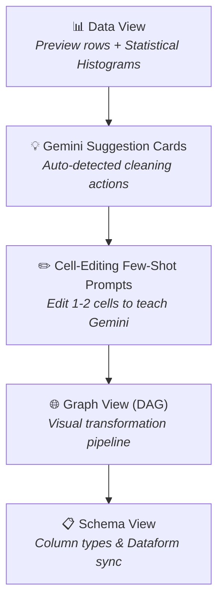

# Module 03: Data Cleaning, Transformation & Visual Data Prep
**Luxottica Marketing Data Training**  
**GCP Project ID:** `qwiklabs-gcp-04-9efaa47f1d21` (`bigquery-luxottica`)  
**Target Dataset:** `qwiklabs-gcp-04-9efaa47f1d21.luxottica_marketing_analytics`  
**Date:** Oct 12th, 2026 | **Time:** 17:45 - 18:15 (Block 4)

---

## 1. Principles of Dataset Integrity in Marketing Analytics

Dirty data distorts executive reporting, ruins attribution models, and wastes ad budgets. Core wrangling challenges include:
- **String Inconsistencies:** Leading/trailing spaces, mixed capitalization (`Ray-Ban`, `ray-ban`, `RAY BAN`).
- **Data Type Mismatches:** Currency strings (`€ 175.00`) or non-numeric values passed as strings.
- **Inconsistent Date Formats:** ISO (`2026-09-01`), European (`01/09/2026`), or Verbal (`Sep 01, 2026`).
- **Duplicate Records:** Multiple lead form submissions for the same user.

---

## 2. BigQuery Studio Visual Data Preparation (Low-Code / No-Code)

BigQuery Studio provides **Visual Data Preparation** powered by **Gemini in BigQuery**. It allows business analysts to clean and transform datasets visually without writing SQL manually:



### Key Visual Data Prep Views:
1. **Data View:** Interactive preview grid showing **statistical distribution histograms** over every column (null counts, unique values, string patterns).
2. **Graph View (DAG):** Visual node-based flowchart representing each cleaning step in the pipeline.
3. **Schema View:** Direct schema editing interface (rename, drop, or re-type columns visually).
4. **Gemini Suggestion Cards:** Context-aware AI suggestions (e.g., *"Trim leading spaces in raw_lead_id"* or *"Convert raw_email to lowercase"*).
5. **Few-Shot Cell Editing:** Manually edit 1 or 2 cells in the grid to demonstrate the desired clean format — Gemini automatically infers the transformation rule for all remaining rows!

---

## 3. SQL Data Wrangling Toolkit (Behind the Scenes)

Whether applied visually or written in SQL, these core functions execute natively in BigQuery:

### 3.1 String Standardization
```sql
SELECT
  TRIM(raw_lead_id) AS lead_id,
  LOWER(TRIM(raw_email)) AS clean_email,
  INITCAP(TRIM(REGEXP_REPLACE(raw_brand, r'[^a-zA-Z0-9\s-]', ''))) AS clean_brand,
  CAST(REGEXP_REPLACE(raw_estimated_spend, r'[^\d.]', '') AS NUMERIC) AS clean_spend_eur
FROM `qwiklabs-gcp-04-9efaa47f1d21.luxottica_marketing_analytics.lux_raw_marketing_leads_dirty`;
```

### 3.2 Defensive Type Casting (`SAFE_CAST`)
`SAFE_CAST('abc' AS INT64)` returns `NULL` safely without crashing the query job.

### 3.3 Date Parsing
`PARSE_DATE('%d/%m/%Y', date_str)` converts European dates into standard BigQuery `DATE` types.

### 3.4 Deduplication using `QUALIFY` and `ROW_NUMBER()`
```sql
SELECT
  lead_id, clean_email, clean_brand, signup_date, estimated_spend_eur
FROM (
  SELECT
    TRIM(raw_lead_id) AS lead_id,
    LOWER(TRIM(raw_email)) AS clean_email,
    INITCAP(TRIM(raw_brand)) AS clean_brand,
    signup_raw_date, raw_estimated_spend, lead_priority
  FROM `qwiklabs-gcp-04-9efaa47f1d21.luxottica_marketing_analytics.lux_raw_marketing_leads_dirty`
)
QUALIFY ROW_NUMBER() OVER(PARTITION BY clean_email ORDER BY lead_priority ASC) = 1;
```
