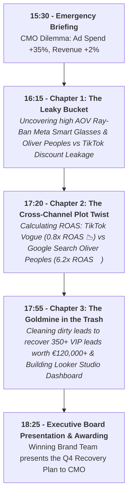

# 🕶️ Luxottica BigQuery Training: Instructor Master Guide
## The Definitive 180-Minute Facilitation & Preparation Manual

**Course Title:** BigQuery for Data Analysis: Mastering Marketing Data with BigQuery SQL  
**Story Narrative:** "The Mystery of the Leaky Ad Budget & The Smart Glasses Breakthrough"  
**GCP Project Name:** `bigquery-luxottica`  
**GCP Project ID:** `qwiklabs-gcp-04-9efaa47f1d21`  
**Project Owner:** `student-02-25b97e18011e@qwiklabs.net` (student b50b8eff)  
**Target Dataset:** `qwiklabs-gcp-04-9efaa47f1d21.luxottica_marketing_analytics`  
**Target Audience:** Global Analytics, Business Analyst, Digital Commerce & Retail Operations  
**Date & Time:** Oct 12th, 2026 | 15:30 - 18:30 (3 Hours / 180 Minutes)  
**Format:** Hybrid (In-Person & Remote Connection)

---

## 📋 1. Trainer Pre-Flight & Setup Checklist (Before 15:30)

### 1.1 GCP Environment & IAM Setup
1. **Target Project:** `qwiklabs-gcp-04-9efaa47f1d21` (`bigquery-luxottica`).
2. **Dataset Pre-loading:** Execute `dataset/00_setup_schema_and_data.sql` **BEFORE** the session starts.
3. **Verify Table Creation (116,000+ Total Rows):**
   - `lux_crm_customers` (10,000 Rows)
   - `lux_online_orders` (100,000 Rows)
   - `lux_ad_spend` (5,000 Rows)
   - `lux_raw_marketing_leads_dirty` (1,000 Rows)
4. **IAM Roles Assigned to Participants:**
   - `BigQuery Job User` (`roles/bigquery.jobUser`) on project `qwiklabs-gcp-04-9efaa47f1d21`.
   - `BigQuery Data Viewer` (`roles/bigquery.dataViewer`) on dataset `luxottica_marketing_analytics`.

### 1.2 Materials & File Sharing Strategy
1. **Participant Handouts Folder (Drive / Intranet):**
   - [student_guide.md](file:///Users/maurizio.ipsale/Code/my-agy-projects/projectA/student_guide.md) (Student Quick Start & Rosetta Stone Cheat Sheet)
   - [00_data_storytelling_narrative.md](file:///Users/maurizio.ipsale/Code/my-agy-projects/projectA/handouts/00_data_storytelling_narrative.md) (Step-by-Step Analytical Script)
   - Exercise SQL files: `challenges/challenge_1_data_explorer.sql`, `challenges/challenge_2_cross_channel.sql`, `challenges/challenge_3_clean_slate.sql`.
2. **Console Pinning Instructions:** Show participants how to click **"+ ADD" -> "Star a project by name"** and type `qwiklabs-gcp-04-9efaa47f1d21`.

---

## 🎬 2. The Storytelling Narrative & Gamification Framework

> **The Executive Problem (15:30 Briefing):**  
> *"Global digital ad spend across Meta, TikTok, and Google increased by +35%, but overall online revenue growth stayed flat at +2%. The CMO needs a Q4 Recovery Plan! Your teams of Marketing Data Detectives have 3 hours in BigQuery Studio to solve the mystery, find the budget leaks, discover secret high-ROAS growth drivers, and recover lost VIP lead revenue!"*

---

## 🏆 3. Gamification Rules & Brand Detective Teams

- **4 Brand Teams:** Team Ray-Ban, Team Oakley, Team Persol, Team Oliver Peoples.
- **Points System:**
  - First team with correct SQL query: **+100 Points**
  - Best business insight/story interpretation: **+50 Points**
  - Most creative Looker Studio Executive Dashboard: **+100 Points**

---

## ⏱️ 4. 180-Minute Master Schedule & Step-by-Step Flow

### 🕒 15:30 - 16:00 | Block 1: Executive Briefing, Data Insights & Data Canvas (30 Mins)

- **15:30 - 15:40 (10m) | Emergency Briefing & Icebreaker**
  - Present the CMO Dilemma: Ad Spend +35%, Revenue +2%.
  - Icebreaker Poll: *"Where do you suspect the marketing money is leaking?"*

- **15:40 - 15:52 (12m) | BigQuery Studio, Data Insights & Data Canvas Demo**
  - Open dataset `qwiklabs-gcp-04-9efaa47f1d21.luxottica_marketing_analytics`.
  - **Data Insights Demo (`cloud.google.com/bigquery/docs/data-insights`):** Click *"Generate Data Insights"* to render the **Interactive Relationship Graph**. Show how Gemini maps `lux_crm_customers` -> `lux_online_orders` -> `lux_ad_spend`!
  - **Data Canvas Demo:** Show visual DAG nodes (Search, Table, SQL, Visualization, Insights Node).

- **15:52 - 16:00 (8m) | First Code-Along Query (Checking Total Revenue vs Spend)**

---

### 🕒 16:00 - 16:45 | Block 2: Chapter 1 - "The Leaky Bucket" (45 Mins)

- **16:00 - 16:15 (15m) | Core SQL Building Blocks (`SELECT`, `WHERE`, `GROUP BY`)**
- **16:15 - 16:40 (25m) | 🏆 Challenge #1: "The Data Explorer" (8 Clues)**
  - Teams investigate sales performance, brand revenue ranking, and discount leakage.
  - **Plot Twist #1 Discovered:** *Ray-Ban Meta Smart Glasses* and *Oliver Peoples* have massive Average Order Values (> €300), but heavy discount promotions on *Vogue Eyewear* are destroying margins!
- **16:40 - 16:45 (5m) | Chapter 1 Debrief & Scoreboard Update**

---

### ☕ 16:45 - 17:00 | Coffee Break (15 Mins)

---

### 🕒 17:00 - 17:45 | Block 3: Chapter 2 - "The Cross-Channel Plot Twist" (45 Mins)

- **17:00 - 17:20 (20m) | Advanced SQL: UNIONS, JOINS & CTEs**
- **17:20 - 17:40 (20m) | 🏆 Challenge #2: "Cross-Channel Intelligence" (4 Clues)**
  - Teams calculate Customer LTV and Multi-Platform Brand ROAS.
  - **Plot Twist #2 Discovered:** *TikTok Vogue Eyewear* campaigns have a disastrous **0.8x ROAS** (losing money!), while *Google Search Oliver Peoples & Persol* have a stellar **6.2x ROAS**!
- **17:40 - 17:45 (5m) | Chapter 2 Debrief & Scoreboard Update**

---

### 🕒 17:45 - 18:15 | Block 4: Chapter 3 - "The Goldmine in the Trash" (30 Mins)

- **17:45 - 17:55 (10m) | DEMO: BigQuery Studio Visual Data Prep**
  - Show Gemini suggestion cards and few-shot cell editing for data wrangling.
- **17:55 - 18:10 (15m) | 🏆 Challenge #3: "The Clean Slate" (Automated View & Looker Studio)**
  - Teams clean `lux_raw_marketing_leads_dirty` into `v_clean_marketing_leads`.
  - **Plot Twist #3 Discovered:** Cleaning dirty leads recovers **350+ valid VIP leads** worth over **€120,000 in Q4 revenue**!
  - **1-Click Looker Studio Demo:** Connect the View to Looker Studio to display the **CMO Executive Rescue Dashboard**!
- **18:10 - 18:15 (5m) | Chapter 3 Debrief**

---

### 🕒 18:15 - 18:30 | Block 5: The Q4 Recovery Plan & Award Ceremony (15 Mins)

- **18:15 - 18:25 (10m) | Executive Summary & Security Spotlight**
  - Summarize the Q4 Recovery Plan: Shift 40% of TikTok ad budget to Google Search Oliver Peoples & Ray-Ban Meta Smart Glasses, and activate the 350 recovered VIP leads.
  - Security Spotlight: Row/Column-level security and PII masking.
- **18:25 - 18:30 (5m) | Awarding the Winning Brand Detective Team!**
