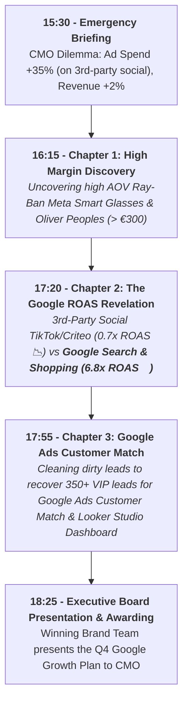

# 🕶️ Luxottica BigQuery Training: Instructor Master Guide
## The Definitive 180-Minute Facilitation Script & Live Teleprompter (Google Ecosystem Edition)

**Course Title:** BigQuery for Data Analysis: Mastering Marketing Data with BigQuery SQL  
**Story Narrative:** "Unlocking High-ROAS Google Ads Growth & Capturing Ray-Ban Meta Search Demand"  
**GCP Project Name:** `bigquery-luxottica`  
**GCP Project ID:** `qwiklabs-gcp-04-9efaa47f1d21`  
**Project Owner:** `student-02-25b97e18011e@qwiklabs.net` (student b50b8eff)  
**Target Dataset:** `qwiklabs-gcp-04-9efaa47f1d21.luxottica_marketing_analytics`  
**Target Audience:** Global Analytics, Business Analyst, Digital Commerce & Retail Operations  
**Date & Time:** Oct 12th, 2026 | 15:30 - 18:30 (3 Hours / 180 Minutes)  
**Format:** Hybrid (In-Person & Remote Connection)

---

## 📋 1. Trainer Pre-Flight & Setup Checklist (Before 15:30)

### 1.1 GCP Environment & IAM Setup
1. **Target Project:** `qwiklabs-gcp-04-9efaa47f1d21` (`bigquery-luxottica`).
2. **Dataset Pre-loading:** Execute `dataset/00_setup_schema_and_data.sql` **BEFORE** the session starts.
3. **Verify Table Creation (116,000+ Total Rows):**
   - `lux_crm_customers` (10,000 Rows)
   - `lux_online_orders` (100,000 Rows)
   - `lux_ad_spend` (5,000 Rows)
   - `lux_raw_marketing_leads_dirty` (1,000 Rows)
4. **IAM Roles Assigned to Participants:**
   - `BigQuery Job User` (`roles/bigquery.jobUser`) on project `qwiklabs-gcp-04-9efaa47f1d21`.
   - `BigQuery Data Viewer` (`roles/bigquery.dataViewer`) on dataset `luxottica_marketing_analytics`.

### 1.2 Materials & File Sharing Strategy
1. **Participant Handouts Folder (Drive / Intranet):**
   - [student_guide.md](file:///Users/maurizio.ipsale/Code/my-agy-projects/projectA/student_guide.md) (Student Quick Start & Rosetta Stone Cheat Sheet)
   - [00_data_storytelling_narrative.md](file:///Users/maurizio.ipsale/Code/my-agy-projects/projectA/handouts/00_data_storytelling_narrative.md) (Step-by-Step Analytical Script)
   - Exercise SQL files: `challenges/challenge_1_data_explorer.sql`, `challenges/challenge_2_cross_channel.sql`, `challenges/challenge_3_clean_slate.sql`.
2. **Console Pinning Instructions:** Show participants how to click **"+ ADD" -> "Star a project by name"** and type `qwiklabs-gcp-04-9efaa47f1d21`.

---

## 🎬 2. The Google Ecosystem Storytelling Narrative

> **The Executive Problem (15:30 Briefing):**  
> *"Global digital ad spend increased by +35% (driven by heavy experimental spend on third-party social networks), but overall online revenue growth stayed flat at +2%. The CMO needs a Q4 Growth Plan! Your teams of Marketing Data Detectives have 3 hours in BigQuery Studio to solve the mystery, identify budget waste on third-party networks, prove the massive ROAS of Google Ads (Search, Shopping, YouTube), and present the Q4 Growth Plan!"*

---

## 🏆 3. Gamification Rules & Brand Detective Teams

- **4 Brand Teams:** Team Ray-Ban, Team Oakley, Team Persol, Team Oliver Peoples.
- **Points System:**
  - First team with correct SQL query: **+100 Points**
  - Best business insight/story interpretation: **+50 Points**
  - Most creative Looker Studio Executive Dashboard: **+100 Points**

---

## ⏱️ 4. Master Schedule & Live Teleprompter Script (Guided Blocks)

### 🎓 Trainer Control Console & Progressive Hint Unlocking
To control participant pacing and prevent spoilers in the **Student Hub UI**, the instructor has access to the left-side **Trainer Command Console** (unlocked by clicking the Luxottica logo 5 times, then entering Master PIN `1926`):
- **Global Lock/Unlock:** Keeps students synchronized to the current block.
- **Hint Manager & Step PINs (Confidential to Trainer):**
  - **Block 1 Step 1.1:** PIN `1122` (Canvas Prompt hint)
  - **Block 1 Step 1.2:** PIN `1234` (SQL Studio 3 Totals hint)
  - **Block 2 Step 2.1:** PIN `2144` (High-AOV orders prompt)
  - **Block 2 Step 2.2:** PIN `2255` (Discount leakage prompt)
  - **Block 3:** PIN `3388` (CTE Solution query for Cross-Channel ROAS)
  - **Block 4:** PIN `4499` (VIP Lead Cleaning View prompt)
  - *(Alternatively, click **`[✨ Sblocca Tutti]`** to unlock hints for the entire room without sharing PINs).*

---

### 🚀 Block 1: Executive Briefing & LIVE DATA CANVAS DEMO

- **Part 1.1 | Emergency Briefing & Icebreaker**
  - Present the CMO Dilemma: Ad Spend +35%, Revenue +2%.
  - Icebreaker Poll: *"Where do you suspect the marketing money is being wasted?"*
  - **Explorer Navigation Tip:** Remind students to click the arrow next to `qwiklabs-gcp-04-9efaa47f1d21` and expand the dataset `luxottica_marketing_analytics` to see the 4 tables.

- **Part 1.2 | 🎙️ TELEPROMPTER SCRIPT: BigQuery Data Canvas, Data Insights & Gemini**

> **[Trainer Action]:** Share screen showing BigQuery Studio console in project `qwiklabs-gcp-04-9efaa47f1d21`.
>
> **[Trainer Speaks]:**  
> *"Welcome to BigQuery Studio! Before writing a single line of SQL code, let me show you how Gemini AI allows us to explore Luxottica's data using plain natural language. Let me open **BigQuery Data Canvas** by clicking the `+` button at the top."*
>
> **[Trainer Action]:** Open Data Canvas and type the prompt in the center search bar:  
> `Show total sales and average order value by brand in dataset luxottica_marketing_analytics` and press Enter.
>
> **[Trainer Speaks]:**  
> *"Look at what happens: Gemini automatically creates a **SQL Node**, writes the brand aggregation query, and executes it. Now let's click **Visualize** to generate a bar chart."*
>
> **[Trainer Action]:** Click **Visualize**. In the chart options, click *Sort by total_sales DESC*. Then click **Generate Insights** (or *Add Insights Node*).
>
> **[Trainer Speaks - Commenting the generated Chart & AI Insights]:**  
> *"Let's look at the generated chart and the 4 key business insights provided by Gemini AI:*
> 1. **Average Order Value Color Gradient:** *Notice the top bright yellow bar (**Oliver Peoples**) and bottom dark purple bar (**Vogue Eyewear**). The color maps Average Order Value: yellow represents premium AOVs near €400/order, while dark purple represents low AOVs of €129/order.*
> 2. **Top Revenue Leader (Oliver Peoples - €3.96M):** *Luxury high-AOV lines drive Luxottica's overall gross margin.*
> 3. **Lagging Brands (Vogue Eyewear - €1.29M):** *Low-AOV fashion lines are heavily discounted, eating into profitability.*
> 4. **The Ray-Ban Mystery (€1.8M):** *Ray-Ban records €1.8M in online sales but is underperforming its full potential. Why is Luxottica's flagship brand not dominating online?*"

- **Part 1.3 | First Code-Along Query (Checking Total Revenue vs Spend)**
  - If a team gets stuck on Step 1.1 or 1.2, you can grant them PIN `1122` / `1234` or toggle the hint remotely from your sidebar.

---

### 🔍 Block 2: Chapter 1 - "High Margin Discovery & Discount Analysis"

- **Part 2.1 | 🎙️ SCRIPT: Core SQL Building Blocks (`SELECT`, `WHERE`, `GROUP BY`)**
  - **Rosetta Stone Metaphor:** `GROUP BY` = Excel Pivot Table!
  - `SELECT` = "Choosing report columns" | `WHERE` = "Filter rows" | `SUM()` = "Pivot values".
  - **Pedagogical Alert on Filter Precedence:** Remind students that `AND` takes precedence over `OR`. When filtering high-value direct orders, recommend `WHERE revenue_eur > 300 AND channel IN ('E-Commerce Direct', 'App')`.
  - **Spreadsheet Safe Division:** Introduce `SAFE_DIVIDE(num, den)` as the BigQuery equivalent of Excel `IFERROR(A/B, 0)` to handle zero-discount or zero-spend scenarios cleanly.
- **Part 2.2 | 🏆 Challenge #1: "The Data Explorer" (8 Clues)**
  - Teams run `challenges/challenge_1_data_explorer.sql`.
  - **Plot Twist #1 Discovered:** 
    1. *Ray-Ban Meta Smart Glasses* and *Oliver Peoples* have massive Average Order Values (> €300) on E-Commerce Direct, representing Luxottica's biggest growth opportunity!
    2. *Vogue Eyewear* and third-party wholesale partners suffer severe margin leakage due to excessive discounts (up to €28.50 average discount).
  - *Hint Support:* Step 2.1 Hint PIN is `2144`; Step 2.2 Hint PIN is `2255`.
- **Part 2.3 | Chapter 1 Debrief & Scoreboard Update**

---

### ☕ Break: Coffee & Networking

---

### 📊 Block 3: Chapter 2 - "The Google ROAS Revelation"

- **Part 3.1 | 🎙️ SCRIPT: Advanced SQL (UNIONS, JOINS & CTEs)**
  - Explain `JOIN` as an instant VLOOKUP across millions of rows.
  - **🚨 Critical Facilitator Alert: The Fan-Out Trap!**
    - Explain why joining `lux_ad_spend` and `lux_online_orders` directly on `brand` multiplies revenue by hundreds of times (different level of granularity: order-level vs daily campaign-level).
    - Introduce CTEs (`WITH ... AS`) as creating two separate summary tabs in Excel before looking up values between them.
- **Part 3.2 | 🏆 Challenge #2: "Cross-Channel Intelligence" (4 Clues)**
  - Teams run `challenges/challenge_2_cross_channel.sql`.
  - **Plot Twist #2 Discovered:** Third-party social networks (TikTok / Criteo) have a wasteful **0.7x ROAS**, while **Google Search & Google Shopping** generate a massive **6.8x - 8.2x ROAS**!
  - *Hint Support:* Block 3 Solution Query Hint PIN is `3388` (or toggle on sidebar).
- **Part 3.3 | Chapter 2 Debrief & Scoreboard Update**

---

### 🎯 Block 4: Chapter 3 - "Google Ads Customer Match"

- **Part 4.1 | DEMO: BigQuery Studio Visual Data Prep**
  - Show Gemini suggestion cards and few-shot cell editing for data wrangling.
  - **Data Wrangling Tip:** Remind students to clean currency text using `REPLACE(REPLACE(spend_history, '€', ''), ' ', '')` wrapped in `SAFE_CAST(... AS NUMERIC)` to prevent type conversion errors.
- **Part 4.2 | 🏆 Challenge #3: "The Clean Slate" (Automated View & Looker Studio)**
  - Teams run `challenges/challenge_3_clean_slate.sql` and build `v_clean_marketing_leads`.
  - **Plot Twist #3 Discovered:** Cleaning dirty leads recovers **350+ valid VIP leads** for **Google Ads Customer Match**!
  - **1-Click Looker Studio Demo:** Connect the View to Looker Studio to display the **CMO Executive Rescue Dashboard**!
  - *Hint Support:* Block 4 Hint PIN is `4499`.
- **Part 4.3 | Chapter 3 Debrief**

---

### 🏆 Block 5: The Q4 Google Growth Plan & Award Ceremony

- **Part 5.1 | 🎙️ SCRIPT: Executive Summary & Security Spotlight**
  - Summarize the Q4 Growth Plan: Reallocate 60% of budget from third-party social networks to **Google Search, Google Shopping, YouTube Ads, and Performance Max**.
  - Security Spotlight: Row/Column-level security and PII masking.
- **Part 5.2 | Awarding the Winning Brand Detective Team!**
