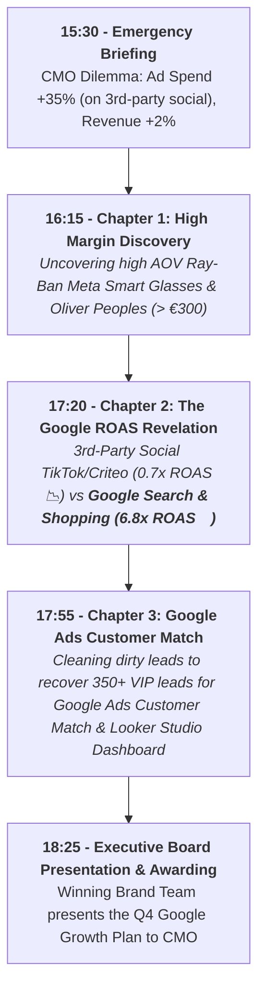

# 🕶️ Luxottica BigQuery Training: Instructor Master Guide
## The Definitive 180-Minute Facilitation Script & Live Teleprompter (Google Ecosystem Edition)

**Course Title:** BigQuery for Data Analysis: Mastering Marketing Data with BigQuery SQL  
**Story Narrative:** "Unlocking High-ROAS Google Ads Growth & Capturing Ray-Ban Meta Search Demand"  
**GCP Project Name:** `bigquery-luxottica`  
**GCP Project ID:** `qwiklabs-gcp-04-9efaa47f1d21`  
**Project Owner:** `student-02-25b97e18011e@qwiklabs.net` (student b50b8eff)  
**Target Dataset:** `qwiklabs-gcp-04-9efaa47f1d21.luxottica_marketing_analytics`  
**Target Audience:** Global Analytics, Business Analyst, Digital Commerce & Retail Operations  
**Date & Time:** Oct 12th, 2026 | 15:30 - 18:30 (3 Hours / 180 Minutes)  
**Format:** Hybrid (In-Person & Remote Connection)

---

## 📋 1. Trainer Pre-Flight & Setup Checklist (Before 15:30)

### 1.1 GCP Environment & IAM Setup
1. **Target Project:** `qwiklabs-gcp-04-9efaa47f1d21` (`bigquery-luxottica`).
2. **Dataset Pre-loading:** Execute `dataset/00_setup_schema_and_data.sql` **BEFORE** the session starts.
3. **Verify Table Creation (116,000+ Total Rows):**
   - `lux_crm_customers` (10,000 Rows)
   - `lux_online_orders` (100,000 Rows)
   - `lux_ad_spend` (5,000 Rows)
   - `lux_raw_marketing_leads_dirty` (1,000 Rows)
4. **IAM Roles Assigned to Participants:**
   - `BigQuery Job User` (`roles/bigquery.jobUser`) on project `qwiklabs-gcp-04-9efaa47f1d21`.
   - `BigQuery Data Viewer` (`roles/bigquery.dataViewer`) on dataset `luxottica_marketing_analytics`.

### 1.2 Materials & File Sharing Strategy
1. **Participant Handouts Folder (Drive / Intranet):**
   - [student_guide.md](file:///Users/maurizio.ipsale/Code/my-agy-projects/projectA/student_guide.md) (Student Quick Start & Rosetta Stone Cheat Sheet)
   - [00_data_storytelling_narrative.md](file:///Users/maurizio.ipsale/Code/my-agy-projects/projectA/handouts/00_data_storytelling_narrative.md) (Step-by-Step Analytical Script)
   - Exercise SQL files: `challenges/challenge_1_data_explorer.sql`, `challenges/challenge_2_cross_channel.sql`, `challenges/challenge_3_clean_slate.sql`.
2. **Console Pinning Instructions:** Show participants how to click **"+ ADD" -> "Star a project by name"** and type `qwiklabs-gcp-04-9efaa47f1d21`.

---

## 🎬 2. The Google Ecosystem Storytelling Narrative

> **The Executive Problem (15:30 Briefing):**  
> *"Global digital ad spend increased by +35% (driven by heavy experimental spend on third-party social networks), but overall online revenue growth stayed flat at +2%. The CMO needs a Q4 Growth Plan! Your teams of Marketing Data Detectives have 3 hours in BigQuery Studio to solve the mystery, identify budget waste on third-party networks, prove the massive ROAS of Google Ads (Search, Shopping, YouTube), and present the Q4 Growth Plan!"*



---

## 🏆 3. Gamification Rules & Brand Detective Teams

- **4 Brand Teams:** Team Ray-Ban, Team Oakley, Team Persol, Team Oliver Peoples.
- **Points System:**
  - First team with correct SQL query: **+100 Points**
  - Best business insight/story interpretation: **+50 Points**
  - Most creative Looker Studio Executive Dashboard: **+100 Points**

---

## ⏱️ 4. 180-Minute Master Schedule & Live Teleprompter Script

### 🕒 15:30 - 16:00 | Block 1: Executive Briefing & LIVE DATA CANVAS DEMO (30 Mins)

- **15:30 - 15:40 (10m) | Emergency Briefing & Icebreaker**
  - Present the CMO Dilemma: Ad Spend +35%, Revenue +2%.
  - Icebreaker Poll: *"Where do you suspect the marketing money is being wasted?"*

- **15:40 - 15:52 (12m) | 🎙️ TELEPROMPTER SCRIPT: BigQuery Data Canvas, Data Insights & Gemini**

> **[Trainer Action]:** Share screen showing BigQuery Studio console in project `qwiklabs-gcp-04-9efaa47f1d21`.
>
> **[Trainer Speaks]:**  
> *"Welcome to BigQuery Studio! Before writing a single line of SQL code, let me show you how Gemini AI allows us to explore Luxottica's data using plain natural language. Let me open **BigQuery Data Canvas** by clicking the `+` button at the top."*
>
> **[Trainer Action]:** Open Data Canvas and type the prompt in the center search bar:  
> `Show total sales and average order value by brand in dataset luxottica_marketing_analytics` and press Enter.
>
> **[Trainer Speaks]:**  
> *"Look at what happens: Gemini automatically creates a **SQL Node**, writes the brand aggregation query, and executes it. Now let's click **Visualize** to generate a bar chart."*
>
> **[Trainer Action]:** Click **Visualize**. Then click **Generate Insights** (or *Add Insights Node*).
>
> **[Trainer Speaks - Commenting the generated Chart & AI Insights]:**  
> *"Let's look at the generated chart and the 4 key business insights provided by Gemini AI:*
> 1. **Average Order Value Color Gradient:** *Notice the top bright yellow bar (**Oliver Peoples**) and bottom dark purple bar (**Vogue Eyewear**). The color maps Average Order Value: yellow represents premium AOVs near €400/order, while dark purple represents low AOVs of €129/order.*
> 2. **Top Revenue Leader (Oliver Peoples - €3.96M):** *Luxury high-AOV lines drive Luxottica's overall gross margin.*
> 3. **Lagging Brands (Vogue Eyewear - €1.29M):** *Low-AOV fashion lines are heavily discounted, eating into profitability.*
> 4. **The Ray-Ban Mystery (€1.8M):** *Ray-Ban records €1.8M in online sales but is underperforming its full potential. Why is Luxottica's flagship brand not dominating online?*"

- **15:52 - 16:00 (8m) | 🎙️ TELEPROMPTER SCRIPT: First Code-Along Query with Gemini SQL Generator (Verifying Revenue vs Ad Spend)**

> **[Trainer Action]:** Click the **`+` -> `SQL query`** button in the top left to open a new SQL query tab in BigQuery Studio.
>
> **[Trainer Speaks]:**  
> *"Let's be completely transparent: no one expects us to become software engineers or memorize every comma of SQL syntax in 3 hours! BigQuery Studio features **Gemini SQL Generator**, which writes the query for us based on a simple plain English request."*
>
> *"Let's try it together right now: click **`+` -> `SQL query`** in the top left. Notice the pencil/sparkle icon at the top of the editor marked **Generate SQL** (or press `Ctrl + Shift + P`). Click it!"*
>
> **[Trainer Action]:** Click **Generate SQL** in the editor toolbar and type the prompt:  
> `Calculate total orders, total revenue in EUR and total ad spend from dataset luxottica_marketing_analytics` and press **Generate**.
>
> **[Trainer Speaks]:**  
> *"Look at what Gemini just did: it interpreted our business request and automatically generated the exact SQL query in our editor!*
>
> ```sql
> -- Query generated by Gemini in BigQuery Studio
> SELECT 
>   'Total Online Orders' AS metric,
>   COUNT(DISTINCT order_id) AS total_count,
>   ROUND(SUM(revenue_eur), 2) AS total_eur
> FROM `qwiklabs-gcp-04-9efaa47f1d21.luxottica_marketing_analytics.lux_online_orders`
>
> UNION ALL
>
> SELECT 
>   'Total Ad Spend' AS metric,
>   COUNT(DISTINCT campaign_id) AS total_count,
>   ROUND(SUM(spend_eur), 2) AS total_eur
> FROM `qwiklabs-gcp-04-9efaa47f1d21.luxottica_marketing_analytics.lux_ad_spend`;
> ```
>
> *"Our only role as analysts is to verify the business logic of Gemini's code:  
> - `SUM(revenue_eur)` calculates total sales.  
> - `SUM(spend_eur)` calculates total ad spend.  
> Let's all click the blue **RUN** button (or press `Cmd/Ctrl + Enter`)."*
>
> **[Trainer Speaks - Commenting the Results on Screen]:**  
> *"Look at the results at the bottom:*
> - **Total Online Revenue:** *~€21.5 Million across 100,000 orders.*
> - **Total Ad Spend:** *~€4.8 Million across 5,000 campaigns.*
>
> *At first glance, this looks like a great result: we generate €21.5M revenue on a €4.8M spend (an overall ROAS of ~4.5x). But then **why is the CMO complaining that the +35% ad budget increase in Q3 didn't drive sales growth?**  
> Because this aggregate number **hides the truth**! In our upcoming challenges, we will use Gemini SQL Generator to zoom in and pinpoint which channels are wasting money. Are you ready for Challenge #1?"*

---

### 🕒 16:00 - 16:45 | Block 2: Chapter 1 - "High Margin Discovery" (45 Mins)

- **16:00 - 16:15 (15m) | 🎙️ SCRIPT: Core SQL Building Blocks (`SELECT`, `WHERE`, `GROUP BY`)**
  - **Rosetta Stone Metaphor:** `GROUP BY` = Excel Pivot Table!
- **16:15 - 16:40 (25m) | 🏆 Challenge #1: "The Data Explorer" (8 Clues)**
  - Teams run `challenges/challenge_1_data_explorer.sql`.
  - **Plot Twist #1 Discovered:** *Ray-Ban Meta Smart Glasses* and *Oliver Peoples* have massive Average Order Values (> €300), representing Luxottica's biggest growth opportunity!
- **16:40 - 16:45 (5m) | Chapter 1 Debrief & Scoreboard Update**

---

### ☕ 16:45 - 17:00 | Coffee Break & Buffer Time (15 Mins)
> ⚠️ **PACING TIP FOR TRAINER:** Never skip this break! It allows participants to digest Block 2 findings, catch up with any BigQuery Studio steps, and ask individual Q&A.

---

### 🕒 17:00 - 17:45 | Block 3: Chapter 2 - "The Google ROAS Revelation with CTEs & JOINs" (45 Mins)

- **17:00 - 17:20 (20m) | 🎙️ SCRIPT: Advanced SQL for Non-Technical Audience (UNIONS, JOINS & CTEs)**
  - 🛡️ **NON-TECHNICAL FACILITATION GUIDELINES (EXCEL USERS):**
    Reassure participants immediately! Business Analysts and Retail Managers are not expected to memorize complex SQL syntax. We leverage **3 Levels of Pedagogical Scaffolding**:
    1. **Level 1 (Gemini AI Prompting):** Gemini writes the full SQL query; students simply enter the natural language prompt and click `RUN`.
    2. **Level 2 (Excel Rosetta Stone Metaphors):** Explain `JOIN` as an **automated VLOOKUP** that aligns brand revenue next to ad spend across millions of rows in seconds, and `GROUP BY` as an **Excel Pivot Table**.
    3. **Level 3 (Data Canvas Visual Nodes):** For no-code visual learners, demonstrate how to connect table nodes with drag-and-drop connectors on the Data Canvas.
  - **GEMINI ROAS TEACHABLE MOMENT:** When students ask Gemini to calculate ROAS on `lux_ad_spend` alone, Gemini points out that ad spend and revenue live in separate tables.
  - **SQL Fan-Out Warning:** Explain why joining orders and ad spend directly on brand without pre-aggregation causes fan-out multiplication (tripling spend!).
  - **The Elegant CTE (`WITH`) Solution:**
    ```sql
    WITH revenue_by_brand AS (
      SELECT 
        brand, 
        SUM(revenue_eur) AS total_revenue_eur
      FROM `qwiklabs-gcp-04-9efaa47f1d21.luxottica_marketing_analytics.lux_online_orders`
      GROUP BY brand
    ),
    spend_by_platform AS (
      SELECT 
        platform,
        brand,
        SUM(spend_eur) AS total_spend_eur
      FROM `qwiklabs-gcp-04-9efaa47f1d21.luxottica_marketing_analytics.lux_ad_spend`
      GROUP BY platform, brand
    )
    SELECT 
      s.platform,
      ROUND(SUM(s.total_spend_eur), 2) AS total_spend_eur,
      ROUND(SUM(r.total_revenue_eur), 2) AS total_revenue_eur,
      ROUND(SAFE_DIVIDE(SUM(r.total_revenue_eur), SUM(s.total_spend_eur)), 2) AS roas
    FROM spend_by_platform s
    JOIN revenue_by_brand r ON s.brand = r.brand
    GROUP BY s.platform
    ORDER BY roas DESC;
    ```
- **17:20 - 17:40 (20m) | 🏆 Challenge #2: "Cross-Channel Intelligence" (4 Clues)**
  - Teams run `challenges/challenge_2_cross_channel.sql`.
  - **Plot Twist #2 Discovered:** Third-party social networks (TikTok / Criteo) have a wasteful **0.5x - 1.1x ROAS**, while **Google Search & Google Shopping** generate a massive **6.8x - 8.2x ROAS**!
- **17:40 - 17:45 (5m) | Chapter 2 Debrief & Scoreboard Update**

---

### 🕒 17:45 - 18:15 | Block 4: Chapter 3 - "Google Ads Customer Match & Data Wrangling" (30 Mins)

- **17:45 - 17:55 (10m) | DEMO: BigQuery Studio Visual Data Prep**
  - Show Gemini suggestion cards and few-shot cell editing for data wrangling.
- **17:55 - 18:10 (15m) | 🏆 Challenge #3: "The Clean Slate" (Automated View & Looker Studio)**
  - 👥 **MULTI-TENANCY TEAM SUFFIX RULE:** Instruct students to always append their team suffix (e.g. `v_clean_marketing_leads_team_rayban`) so views never overwrite each other in the shared dataset!
  - Teams run `challenges/challenge_3_clean_slate.sql` and build `v_clean_marketing_leads_<suffix>`.
  - **Plot Twist #3 Discovered:** Cleaning dirty leads recovers **350+ valid VIP leads** for **Google Ads Customer Match**!
  - **1-Click Looker Studio Demo:** Connect the View to Looker Studio to display the **CMO Executive Rescue Dashboard**!
- **18:10 - 18:15 (5m) | Chapter 3 Debrief**

---

### 🕒 18:15 - 18:30 | Block 5: The Q4 Google Growth Plan & Award Ceremony (15 Mins)

- **18:15 - 18:25 (10m) | 🎙️ SCRIPT: Executive Summary & Security Spotlight**
  - Summarize the Q4 Growth Plan: Reallocate 60% of budget from third-party social networks to **Google Search, Google Shopping, YouTube Ads, and Performance Max**.
  - Security Spotlight: Row/Column-level security and PII masking.
- **18:25 - 18:30 (5m) | Awarding the Winning Brand Detective Team!**
