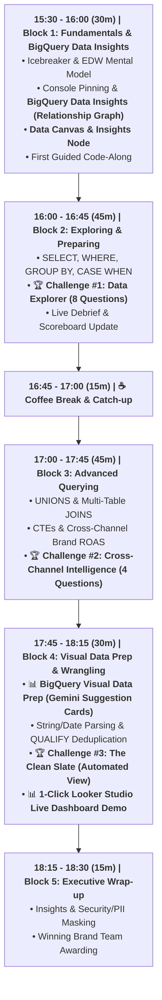

# 🕶️ Luxottica BigQuery Training: Instructor Master Guide
**Course:** BigQuery for Data Analysis: Mastering Marketing Data with BigQuery SQL  
**GCP Project Name:** `bigquery-luxottica`  
**GCP Project ID:** `qwiklabs-gcp-04-9efaa47f1d21`  
**Project Owner:** `student-02-25b97e18011e@qwiklabs.net` (student b50b8eff)  
**Target Dataset:** `qwiklabs-gcp-04-9efaa47f1d21.luxottica_marketing_analytics`  
**Target Audience:** Global Analytics, Business Analyst, Digital Commerce & Retail Operations  
**Duration:** 3 Hours / 180 Minutes (15:30 - 18:30)  
**Format:** Hybrid (In-Person & Remote Connection)

---

## 🕒 180-Minute Master Schedule & Facilitation Flow

---

## ⏱️ Detailed Block-by-Block Execution Script

### 🕒 15:30 - 16:00 | Block 1: BigQuery Fundamentals, Data Insights & Data Canvas (30 Mins)

- **15:30 - 15:40 (10m) | Welcome & Mentimeter Icebreaker**
  - Welcome participants and introduce course objectives.
  - Launch live icebreaker poll: *"What is your biggest daily struggle with Excel spreadsheets?"*
  - Connect answers to BigQuery's serverless speed and scale.

- **15:40 - 15:52 (12m) | BigQuery Studio, Data Insights & Data Canvas**
  - Guide participants live to `https://console.cloud.google.com/bigquery?project=qwiklabs-gcp-04-9efaa47f1d21`.
  - Pin project: **"+ ADD" -> "Star a project by name"** -> `qwiklabs-gcp-04-9efaa47f1d21`.
  - **NEW FEATURE DEMO 1: BigQuery Data Insights (`cloud.google.com/bigquery/docs/data-insights`)**:
    - Open dataset `luxottica_marketing_analytics` and click **"Generate Data Insights"**.
    - Show the **Interactive Relationship Graph**: Explain how Gemini maps connections between `lux_crm_customers`, `lux_online_orders`, and `lux_ad_spend` visually!
    - Show **AI-Generated Table/Column Descriptions** and **Sample SQL Queries** generated with 1 click.
  - **NEW FEATURE DEMO 2: BigQuery Data Canvas & Insights Node**:
    - Show visual DAG nodes (Search -> Table -> SQL -> Visualization -> **Insights Node**).

- **15:52 - 16:00 (8m) | First Guided Code-Along Query**
  - Write a simple SQL query together in the query editor tab. Explain bytes scanned preview.

---

### 🕒 16:00 - 16:45 | Block 2: Exploring & Preparing Data (45 Mins)

- **16:00 - 16:15 (15m) | Lecture & Code-Along: Core SQL Clauses**
  - Teach `SELECT`, `FROM`, `WHERE`, `GROUP BY`, `ORDER BY`.
  - Excel Translation: `SELECT` = Columns, `WHERE` = Filter Header, `GROUP BY` = Pivot Table, `SUM/AVG` = Values.

- **16:15 - 16:40 (25m) | 🏆 Challenge #1: "The Data Explorer" (8 Business Questions)**
  - Divide attendees into 4 Brand Teams (Team Ray-Ban, Team Oakley, Team Persol, Team Oliver Peoples).
  - Open `challenges/challenge_1_data_explorer.sql` containing 8 business questions.

- **16:40 - 16:45 (5m) | Challenge #1 Live Debrief & Scoreboard Update**
  - Project `challenges/challenge_1_solutions.sql`. Award points to winning team.

---

### ☕ 16:45 - 17:00 | Coffee Break & Catch-up Buffer (15 Mins)

---

### 🕒 17:00 - 17:45 | Block 3: Advanced Querying & Cross-Channel Analytics (45 Mins)

- **17:00 - 17:20 (20m) | Lecture & Code-Along: UNIONS & JOINS**
  - Explain `UNION ALL` (vertical stacking) vs `INNER / LEFT JOIN` (horizontal enrichment).
  - Demonstrate CTEs (`WITH` clauses) for aggregating spend and revenue before joining for ROAS.

- **17:20 - 17:40 (20m) | 🏆 Challenge #2: "Cross-Channel Marketing Intelligence" (4 Questions)**
  - Open `challenges/challenge_2_cross_channel.sql`. Calculate LTV and Multi-Platform Brand ROAS.

- **17:40 - 17:45 (5m) | Challenge #2 Solution Review**
  - Review `challenges/challenge_2_solutions.sql`.

---

### 🕒 17:45 - 18:15 | Block 4: Visual Data Prep & Data Wrangling (30 Mins)

- **17:45 - 17:55 (10m) | DEMO: BigQuery Studio Visual Data Prep**
  - Show **Visual Data Preparation** in BigQuery Studio:
    - **Data View:** Column distribution histograms (null counts, string patterns).
    - **Gemini Suggestion Cards:** One-click AI cleaning rules (*Trim spaces*, *Lowercase email*).
    - **Cell Editing Few-Shot Prompts:** Edit 1 cell in the grid to teach Gemini the desired format!

- **17:55 - 18:10 (15m) | 🏆 Challenge #3: "The Clean Slate" (Automated View Creation)**
  - Open `challenges/challenge_3_clean_slate.sql`. Transform dirty leads into `v_clean_marketing_leads`.
  - **1-Click Looker Studio Demo:** Connect the VIEW live to Looker Studio to generate an executive dashboard!

- **18:10 - 18:15 (5m) | Challenge #3 Solution Review**

---

### 🕒 18:15 - 18:30 | Block 5: Key Takeaways, Security & Awards (15 Mins)

- **18:15 - 18:25 (10m) | Executive Summary & Security Spotlight**
  - Highlight business value gained (Data Insights, Data Canvas, Visual Data Prep, ROAS, Looker Studio).
  - Security & PII Spotlight: Row/Column-level security, PII data masking (emails/phones), and isolated cloud tenant governance.

- **18:25 - 18:30 (5m) | Winning Team Awarding & Feedback**
