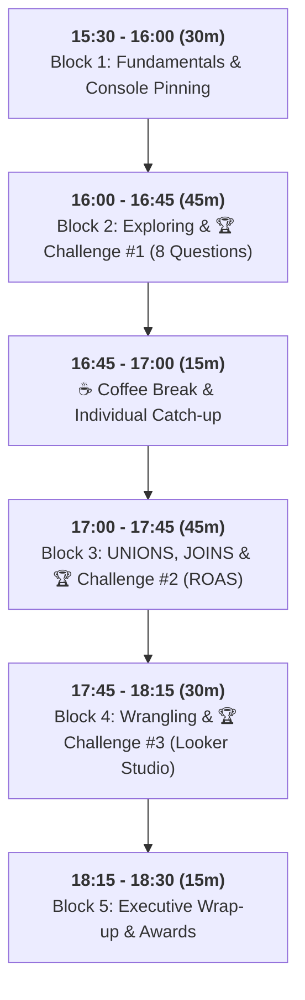

# 🕶️ Luxottica BigQuery Training: Instructor Master Guide
**Course:** BigQuery for Data Analysis: Mastering Marketing Data with BigQuery SQL  
**GCP Project Name:** `bigquery-luxottica`  
**GCP Project ID:** `qwiklabs-gcp-04-9efaa47f1d21`  
**Project Owner:** `student-02-25b97e18011e@qwiklabs.net` (student b50b8eff)  
**Target Dataset:** `qwiklabs-gcp-04-9efaa47f1d21.luxottica_marketing_analytics`  
**Target Audience:** Global Analytics, Business Analyst, Digital Commerce & Retail Operations  
**Duration:** 3 Hours / 180 Minutes (15:30 - 18:30)  
**Format:** Hybrid (In-Person & Remote Connection)

---

## 🕒 Minute-by-Minute 180-Minute Pacing & Facilitation Masterplan

---

## ⏱️ Detailed Block-by-Block Execution Script

### 🕒 15:30 - 16:00 | Block 1: BigQuery Fundamentals & Console Pinning (30 Mins)

- **15:30 - 15:40 (10m) | Welcome & Mentimeter Icebreaker**
  - Welcome participants and introduce the course objectives.
  - Launch live icebreaker poll: *"What is your biggest daily struggle with Excel spreadsheets?"*
  - Debrief answers: Connect vlookup lag and row limits to BigQuery's serverless architecture.

- **15:40 - 15:50 (10m) | Console Orientation & Project Pinning**
  - Guide all participants live to `https://console.cloud.google.com/bigquery?project=qwiklabs-gcp-04-9efaa47f1d21`.
  - Step-by-step pinning: Click **"+ ADD" -> "Star a project by name"** -> Type `qwiklabs-gcp-04-9efaa47f1d21`.
  - Inspect dataset `luxottica_marketing_analytics` and preview schemas for `lux_crm_customers`, `lux_online_orders`, `lux_ad_spend`, `lux_raw_marketing_leads_dirty`.

- **15:50 - 16:00 (10m) | First Guided Code-Along Query**
  - Write a simple query together to count total rows and inspect columns.
  - Explain the query validator (top right corner: bytes scanned and cost preview).

---

### 🕒 16:00 - 16:45 | Block 2: Exploring & Preparing Data (45 Mins)

- **16:00 - 16:15 (15m) | Lecture & Code-Along: Core SQL Clauses**
  - Teach `SELECT`, `FROM`, `WHERE`, `GROUP BY`, `ORDER BY`.
  - Excel Translation: `SELECT` = Columns, `WHERE` = Filter Header, `GROUP BY` = Pivot Table, `SUM/AVG` = Values.
  - Demonstrate conditional filtering with `AND`, `OR`, `IN`, `BETWEEN`.

- **16:15 - 16:40 (25m) | 🏆 Challenge #1: "The Data Explorer" (8 Business Questions)**
  - Divide attendees into 4 Brand Teams (Team Ray-Ban, Team Oakley, Team Persol, Team Oliver Peoples).
  - Open `challenges/challenge_1_data_explorer.sql` containing 8 business questions (E-Commerce revenue, channel sales, high-value transactions, campaign efficiency, discount leakage).
  - Walk the room and check Zoom chat to assist stuck participants.

- **16:40 - 16:45 (5m) | Challenge #1 Live Debrief & Scoreboard Update**
  - Project `challenges/challenge_1_solutions.sql` on screen. Award points to the fastest correct team.

---

### ☕ 16:45 - 17:00 | Coffee Break & Catch-up Buffer (15 Mins)
- Help any struggling remote or in-person participants catch up on BigQuery syntax.

---

### 🕒 17:00 - 17:45 | Block 3: Advanced Querying & Cross-Channel Analytics (45 Mins)

- **17:00 - 17:20 (20m) | Lecture & Code-Along: UNIONS & JOINS**
  - Explain `UNION ALL` (vertical stacking) vs `INNER / LEFT JOIN` (horizontal enrichment).
  - Explain Primary Keys (`customer_id`, `brand`) and avoiding revenue duplication fan-out.
  - Demonstrate CTEs (`WITH` clauses) for aggregating spend and revenue before joining.

- **17:20 - 17:40 (20m) | 🏆 Challenge #2: "Cross-Channel Marketing Intelligence" (4 Questions)**
  - Open `challenges/challenge_2_cross_channel.sql`.
  - Tasks: LTV by Loyalty Tier, Omni-channel UNION stream, Multi-Platform Brand ROAS calculation, Brand Preference Alignment.

- **17:40 - 17:45 (5m) | Challenge #2 Solution Review**
  - Review `challenges/challenge_2_solutions.sql` and explain how ROAS proves marketing ROI.

---

### 🕒 17:45 - 18:15 | Block 4: Data Cleaning & Transformation (30 Mins)

- **17:45 - 17:55 (10m) | Lecture: SQL Data Wrangling Toolkit**
  - Explain string functions (`TRIM`, `LOWER`), `SAFE_CAST` (preventing crashes), `PARSE_DATE` (handling `DD/MM/YYYY`), and `QUALIFY ROW_NUMBER()` for deduplication.
  - *Pedagogical Note:* Keep nested fields (`ARRAY`/`STRUCT`) purely conceptual (max 2 minutes).

- **17:55 - 18:10 (15m) | 🏆 Challenge #3: "The Clean Slate" (Building an Automated ETL View)**
  - Open `challenges/challenge_3_clean_slate.sql`.
  - Transform dirty leads into production VIEW `v_clean_marketing_leads`.
  - **1-Click Looker Studio Demo:** Connect the VIEW live to Looker Studio to generate an executive dashboard!

- **18:10 - 18:15 (5m) | Challenge #3 Solution Review**
  - Inspect `challenges/challenge_3_solutions.sql`.

---

### 🕒 18:15 - 18:30 | Block 5: Key Takeaways, Security & Awards (15 Mins)

- **18:15 - 18:25 (10m) | Executive Summary & Security Spotlight**
  - Highlight business value gained (automated data cleaning, cross-channel ROAS, Looker Studio connectivity).
  - Security & PII Spotlight: Row/Column-level security, PII data masking (emails/phones), and isolated cloud tenant governance.

- **18:25 - 18:30 (5m) | Winning Team Awarding & Feedback**
  - Declare the winning Luxottica Brand Team, share GitHub repository link, and collect feedback.

---

## 🛠️ Troubleshooting & Instructor Cheat Sheet

| Issue | Root Cause | Fix / Response |
| :--- | :--- | :--- |
| **`Table not found`** | Missing project prefix or backticks. | Remind them to use `` `qwiklabs-gcp-04-9efaa47f1d21.luxottica_marketing_analytics.table_name` ``. |
| **`Division by zero`** | Dividing by zero in cost metrics. | Use `SAFE_DIVIDE(numerator, denominator)`. |
| **`Cannot parse date`** | Mixed date format string (`02/09/2026` vs `2026-09-01`). | Use `CASE WHEN string LIKE '%/%' THEN PARSE_DATE('%d/%m/%Y', string) ...` |
