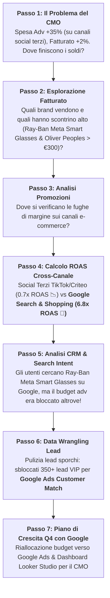

# 🕶️ Guida Docente Master per il Corso BigQuery Luxottica (Edizione Italiana)
## Manuale Integrale di Facilitazione e Conduzione (180 Minuti)

**Titolo Corso:** BigQuery per l'Analisi Dati: Dominare i Dati Marketing con BigQuery SQL & BigQuery Studio  
**Filo Conduttore (Storytelling):** "Sbloccare la Crescita High-ROAS con Google Ads & Catturare la Domanda Ray-Ban Meta"  
**Nome Progetto GCP:** `bigquery-luxottica`  
**ID Progetto GCP:** `qwiklabs-gcp-04-9efaa47f1d21`  
**Owner Progetto:** `student-02-25b97e18011e@qwiklabs.net` (student b50b8eff)  
**Dataset Target:** `qwiklabs-gcp-04-9efaa47f1d21.luxottica_marketing_analytics`  
**Pubblico Target:** Global Analytics, Business Analyst, Digital Commerce & Retail Operations  
**Data & Ora:** 12 Ottobre 2026 | 15:30 - 18:30 (3 Ore / 180 Minuti)  
**Formato:** Ibrido (In Presenza & Collegamento Remoto)

---

## 📋 1. Checklist Pre-Flight del Docente (Prima delle 15:30)

### 1.1 Verifiche Ambiente GCP e IAM
1. **Progetto GCP Target:** `qwiklabs-gcp-04-9efaa47f1d21` (`bigquery-luxottica`).
2. **Pre-caricamento Dataset:** Esegui lo script SQL `dataset/00_setup_schema_and_data.sql` **PRIMA** dell'inizio della sessione.
3. **Verifica Tabelle Create (116.000+ Righe Totali):**
   - `lux_crm_customers` (10.000 Righe)
   - `lux_online_orders` (100.000 Righe)
   - `lux_ad_spend` (5.000 Righe)
   - `lux_raw_marketing_leads_dirty` (1.000 Righe)
4. **Ruoli IAM Assegnati ai Partecipanti:**
   - `BigQuery Job User` (`roles/bigquery.jobUser`) sul progetto `qwiklabs-gcp-04-9efaa47f1d21`.
   - `BigQuery Data Viewer` (`roles/bigquery.dataViewer`) sul dataset `luxottica_marketing_analytics`.

### 1.2 Materiali e Condivisione
1. **Cartella Materiali Partecipanti (Drive / Intranet):**
   - [student_guide.md](file:///Users/maurizio.ipsale/Code/my-agy-projects/projectA/student_guide.md) (Guida Studente & Tabella Rosetta Stone Excel-SQL)
   - [00_data_storytelling_narrative.md](file:///Users/maurizio.ipsale/Code/my-agy-projects/projectA/handouts/00_data_storytelling_narrative.md) (Copione Analitico dei 7 Passi)
   - File SQL delle Challenge: `challenges/challenge_1_data_explorer.sql`, `challenges/challenge_2_cross_channel.sql`, `challenges/challenge_3_clean_slate.sql`.
2. **Istruzione di Pin del Progetto:** Mostra a schermo come cliccare su **"+ ADD" -> "Star a project by name"** e digitare `qwiklabs-gcp-04-9efaa47f1d21`.

---

## 🎬 2. La Narrativa Analitica "Google Hero" (I 7 Passi)

> **Il Briefing per il CMO (Ore 15:30):**  
> *"La spesa pubblicitaria digitale globale di Luxottica è aumentata del +35% (a causa di forti investimenti sperimentali su reticoli social terzi e display frammentate), ma la crescita del fatturato e-commerce è rimasta ferma al +2%. Il CMO esige un Piano di Crescita Q4! Le vostre squadre di Data Detective hanno 3 ore in BigQuery Studio per identificare la dispersione di budget sui canali terzi, dimostrare le prestazioni straordinarie di Google Ads (Search, Shopping, YouTube) e presentare il Piano di Crescita!"*

---

## 🏆 3. Gamification e Competizione a Squadre

- **4 Brand Detective Teams:**
  - 🕶️ **Team Ray-Ban** (Smart Glasses & Categorie Iconiche)
  - 🕶️ **Team Oakley** (Tecnologia Prizm Sport)
  - 🕶️ **Team Persol** (Artigianalità Italiana)
  - 🕶️ **Team Oliver Peoples** (Segmento Lusso)
- **Sistema di Punteggio:**
  - Prima squadra a inviare la query SQL corretta: **+100 Punti**
  - Migliore interpretazione di business dell'insight: **+50 Punti**
  - Dashboard Looker Studio più efficace: **+100 Punti**

---

## ⏱️ 4. Cronoprogramma Dettagliato Minuto per Minuto (180 Minuti)

### 🕒 15:30 - 16:00 | Blocco 1: Executive Briefing, Data Insights & Data Canvas (30 Mins)

- **15:30 - 15:40 (10m) | Briefing d'Emergenza & Icebreaker**
  - Presenta il dilemma del CMO: Spesa Adv +35%, Fatturato +2%.
  - Sondaggio Icebreaker: *"Su quale canale sospetti che si stia sprecando il budget pubblicitario?"*

- **15:40 - 15:52 (12m) | Demo Live: BigQuery Studio, Data Insights & Data Canvas**
  - Apri la console sul dataset `qwiklabs-gcp-04-9efaa47f1d21.luxottica_marketing_analytics`.
  - **Demo BigQuery Data Insights (`cloud.google.com/bigquery/docs/data-insights`):** Clicca *"Generate Data Insights"* per mostrare il **Grafo di Relazione Interattivo** che mappa `lux_crm_customers` -> `lux_online_orders` -> `lux_ad_spend`.
  - **Demo Data Canvas:** Mostra i nodi visuali DAG (Nodo Cerca, Nodo Tabella, Nodo SQL, Nodo Visualizzazione e **Nodo Insights AI**).

- **15:52 - 16:00 (8m) | Prima Query Guidata (Verifica Spesa vs Fatturato Generale)**

---

### 🕒 16:00 - 16:45 | Blocco 2: Capitolo 1 - "Scoperta dei Prodotti ad Alto Margine" (45 Mins)

- **16:00 - 16:15 (15m) | Fondamenti SQL (`SELECT`, `WHERE`, `GROUP BY`)**
  - Spiega la metafora della Rosetta Stone: `GROUP BY` = Tabella Pivot di Excel!
- **16:15 - 16:40 (25m) | 🏆 Challenge #1: "The Data Explorer" (8 Indizi)**
  - Le squadre analizzano le vendite per brand, canale e categoria.
  - **Colpo di Scena #1 Dati:** *Ray-Ban Meta Smart Glasses* e *Oliver Peoples* registrano uno scontrino medio altissimo (> 300 €), rappresentando la massima opportunità di crescita per Luxottica!
- **16:40 - 16:45 (5m) | Debrief Capitolo 1 e Aggiornamento Classifica**

---

### ☕ 16:45 - 17:00 | Coffee Break (15 Mins)

---

### 🕒 17:00 - 17:45 | Blocco 3: Capitolo 2 - "La Rivelazione del ROAS Google Ads" (45 Mins)

- **17:00 - 17:20 (20m) | SQL Avanzato: UNIONS, JOINS & CTE (`WITH`)**
- **17:20 - 17:40 (20m) | 🏆 Challenge #2: "Intelligence Cross-Canale" (4 Indizi)**
  - Le squadre incrociano la spesa adv con il fatturato ordini per calcolare il ROAS per piattaforma.
  - **Colpo di Scena #2 Dati:** I social terzi (TikTok / Criteo) hanno un ROAS fallimentare di **0.7x**, mentre **Google Search e Google Shopping** generano un **ROAS stellare compreso tra 6.8x e 8.2x**!
- **17:40 - 17:45 (5m) | Debrief Capitolo 2 e Aggiornamento Classifica**

---

### 🕒 17:45 - 18:15 | Blocco 4: Capitolo 3 - "Google Ads Customer Match" (30 Mins)

- **17:45 - 17:55 (10m) | DEMO: BigQuery Studio Visual Data Prep**
  - Mostra le schede di suggerimento Gemini e l'editing cellulare few-shot per la pulizia dati senza codice.
- **17:55 - 18:10 (15m) | 🏆 Challenge #3: "The Clean Slate" (Vista Automatica e Looker Studio)**
  - Le squadre puliscono `lux_raw_marketing_leads_dirty` creando la Vista `v_clean_marketing_leads`.
  - **Colpo di Scena #3 Dati:** La pulizia sblocca **350+ lead VIP** pronti per **Google Ads Customer Match**!
  - **Demo Looker Studio 1-Click:** Connetti la Vista a Looker Studio per mostrare il **Dashboard di Crescita Q4** al CMO!
- **18:10 - 18:15 (5m) | Debrief Capitolo 3**

---

### 🕒 18:15 - 18:30 | Blocco 5: Il Piano di Crescita Q4 con Google e Premiazione (15 Mins)

- **18:15 - 18:25 (10m) | Sintesi Strategica & Sicurezza Dati**
  - Riassunto del Piano di Crescita: Spostare il 60% del budget dai canali terzi verso **Google Search, Google Shopping, YouTube Ads e Performance Max**.
  - Sicurezza Dati: Row/Column-level security e mascheramento dei PII (email/telefoni).
- **18:25 - 18:30 (5m) | Premiazione del Brand Detective Team Vincitore!**
